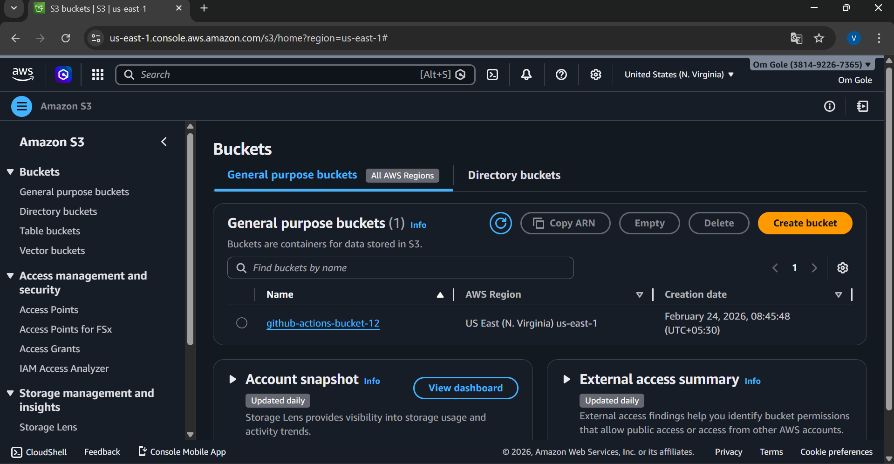
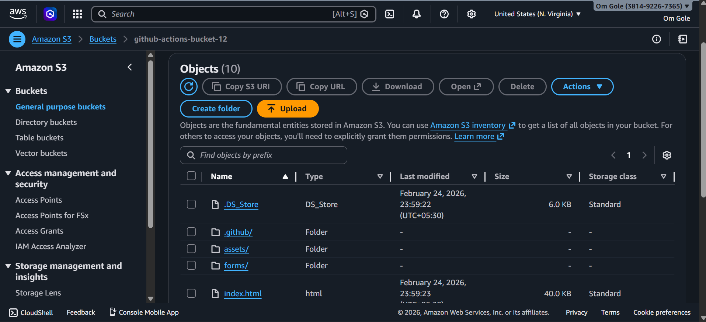
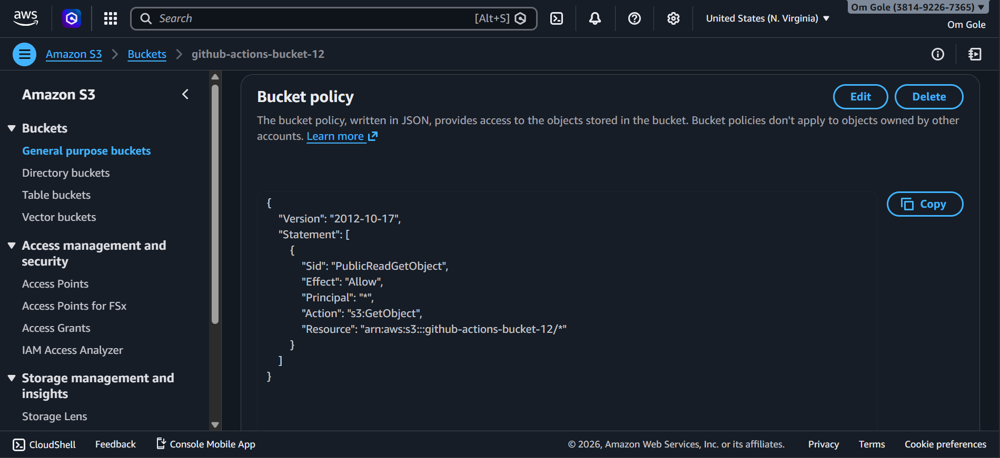
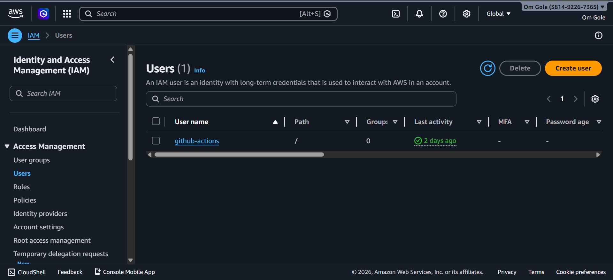
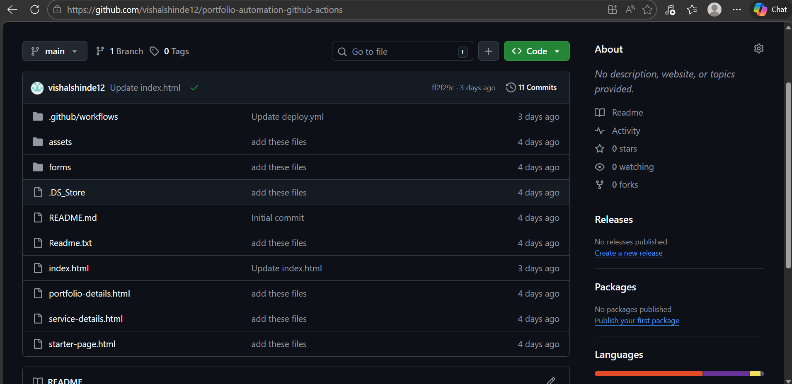
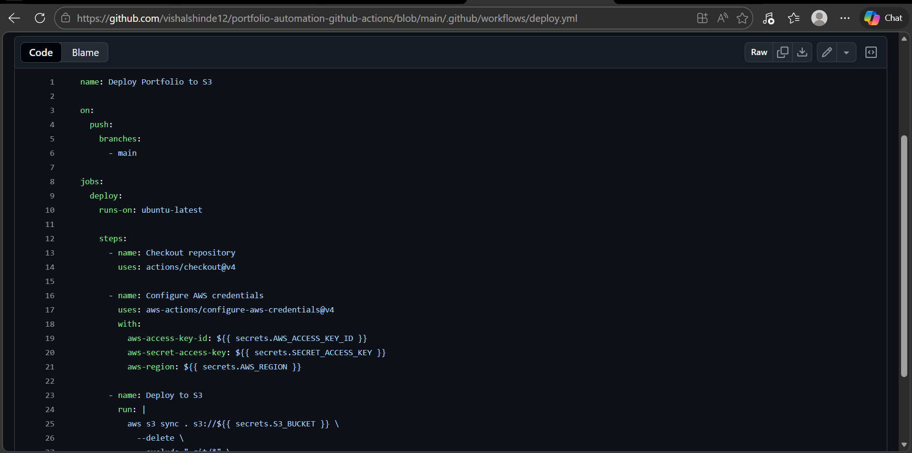
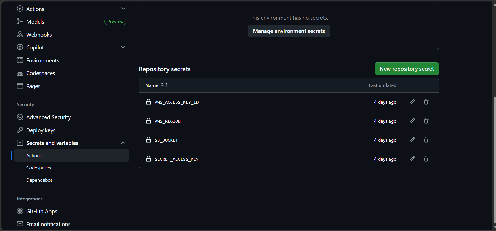
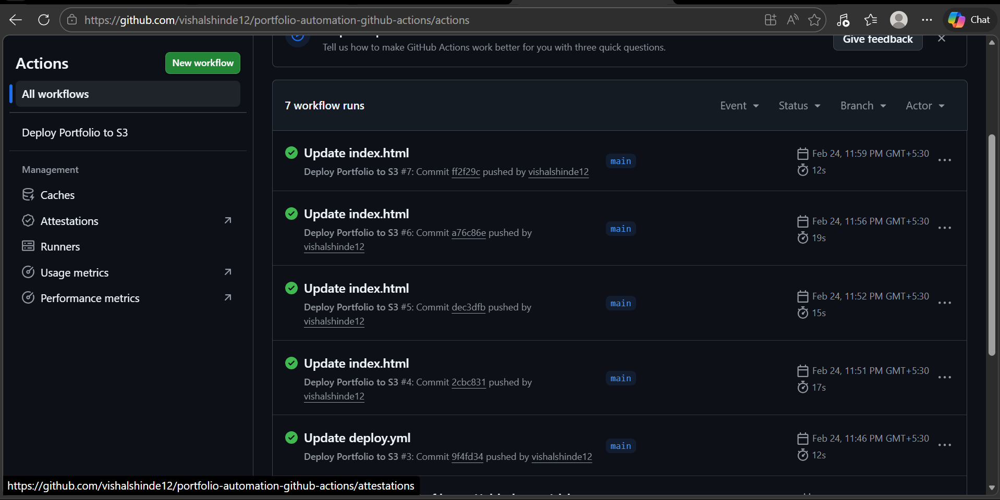
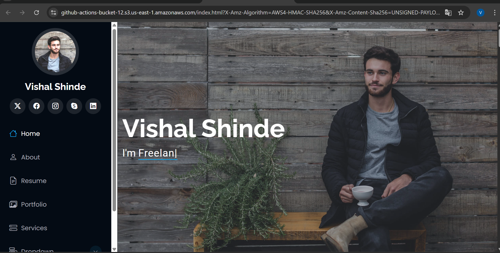

# portfolio-automation-github-actions

## Introduction : 
### Automating deployment makes maintaining a portfolio seamless and efficient. By leveraging GitHub Actions, you can set up a continuous deployment pipeline that automatically builds and publishes your portfolio whenever changes are pushed to the repository. This eliminates manual steps, ensures consistency, and keeps your portfolio always up to date.

## Steps : 
### To Deploy the Portfolio using GitHub Actions

## Step 1 :
### Create S3 Bucket and add files and folders of your portfolio in the Bucket



## Step 2 : 
### Creaye a bucket policy by which the Github actions can access the S3 bucket



## Step 3 : 
### Create an IAM user with Access_key and Secret_Access_Key



## Step 4 :

### Create  a .yml file in github portfolio repo

```
#Path
.github/workflows
```

### Write all the required information in .yml file
```
Aws Access_Key
Aws Secret_Access_Key
Aws Region
```


## Step 5 :
### give all the secrets and variables in github actions


## Step 6 :
### See all the files are successfully run or not 


## Step 7 :
### Now we can see our portfolio is successfully deployed



